# HeadYangDer - User Guide

This guide will help you install and use the **HeadYangDer** extension in Burp Suite, with examples and screenshots.

---

## 📥 Installation

1. Open **Burp Suite**.  
2. Go to **Extender → Extensions → Add**.  
3. Select the extension type:  
   - **Python** (using Jython 2.7)  
4. Load `HeadYangDer.py`  
5. The **HeadYangDer** tab will appear in Burp.  

!(./4.png)

---

## ⚡ Usage

### Step 1: Intercept a request
Capture traffic in **Proxy → HTTP history**, then send the request to **HeadYangDer**.  

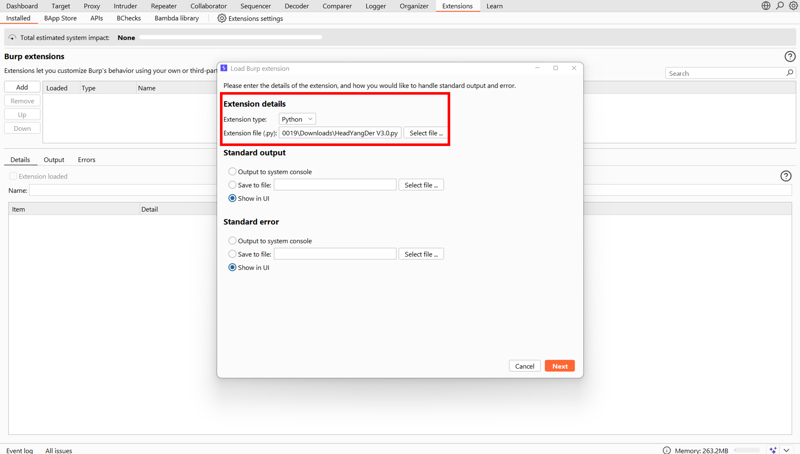

---

### Step 2: Analyze Headers
The extension will check important security headers and display results:  
- ✅ Secure headers present  
- ❌ Missing headers  
- ⚠️ Weak/misconfigured headers  

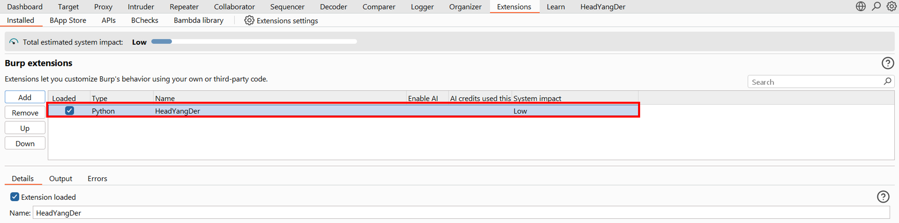

---

### Step 3: View Results in the Extension Tab
Inside the **HeadYangDer** tab, you’ll see a clean table of results.  

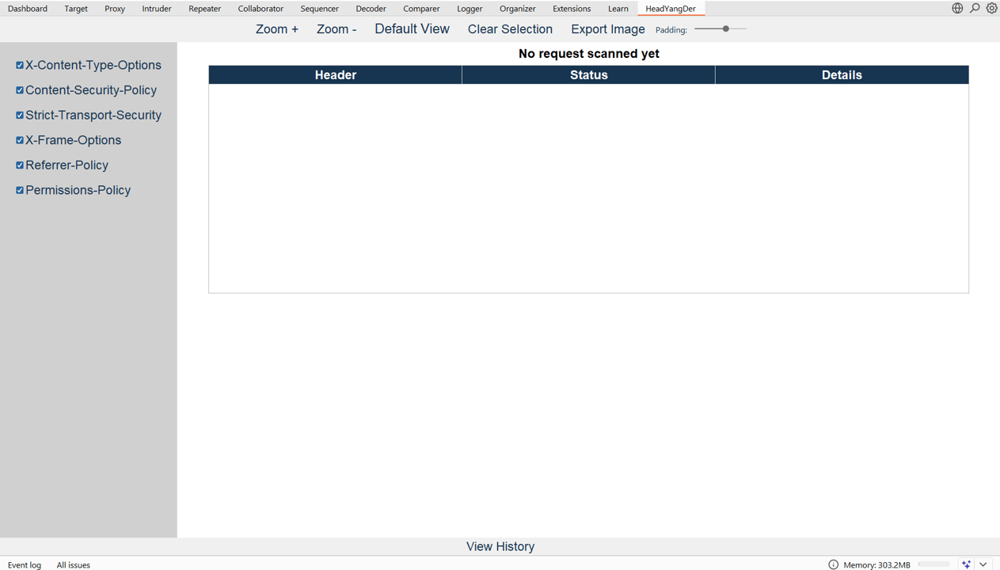

---

### Step 4: Export Findings
Click **Export** to save the results for use in penetration test reports.  

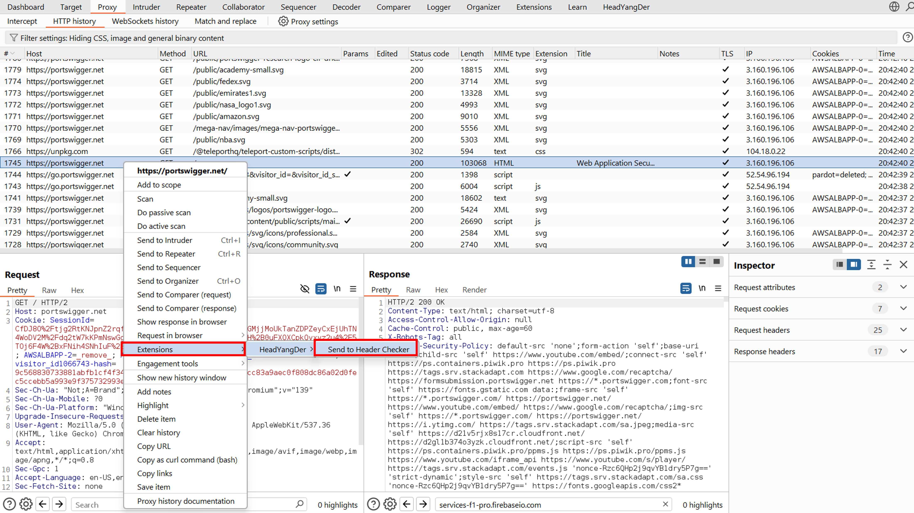

---

## 📚 Example Workflow

Here’s a full example showing the process from start to finish:  

1. Load the extension →   
2. Intercept a request → 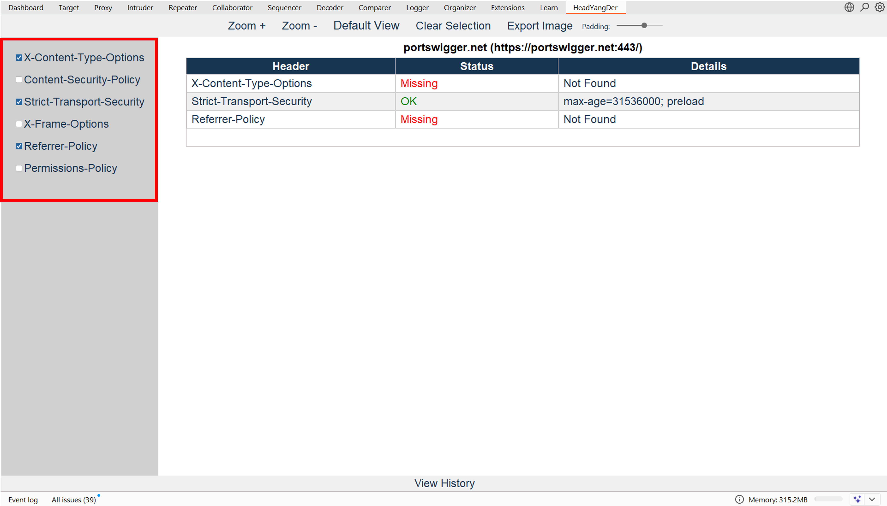  
3. Analyze headers → 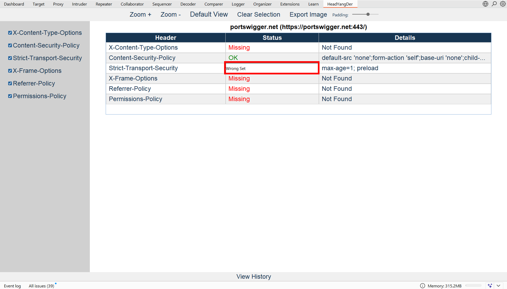  
4. Export report → 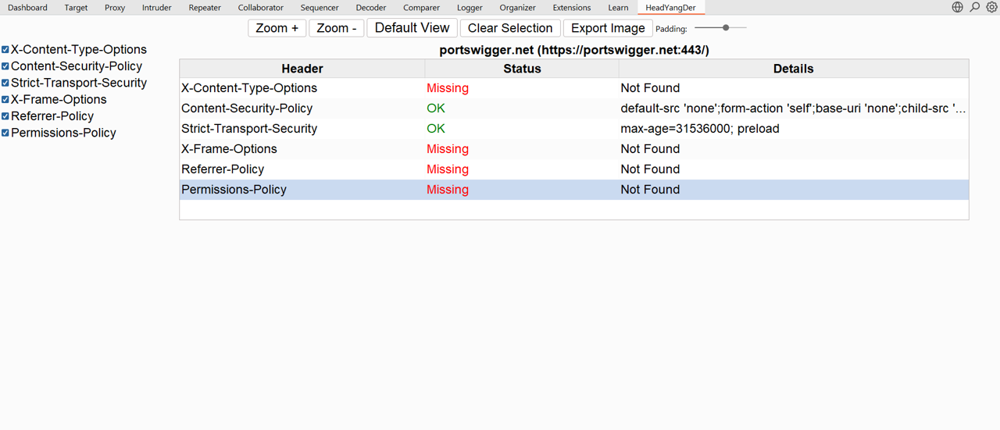  

---

## 🖼️ Additional Screenshots

For reference, more UI screenshots are included:  

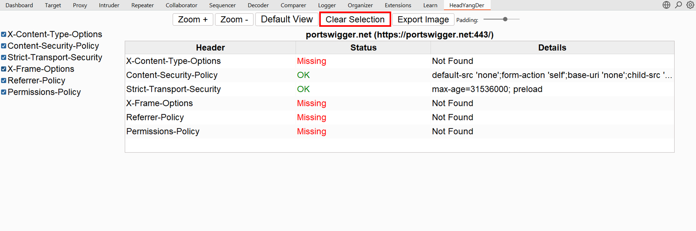  
  
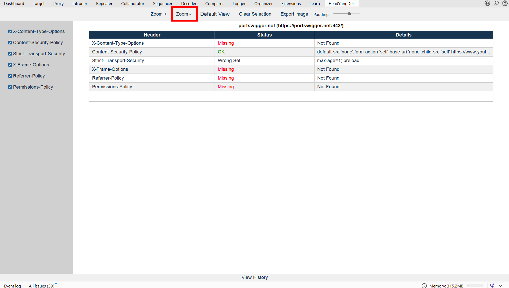  
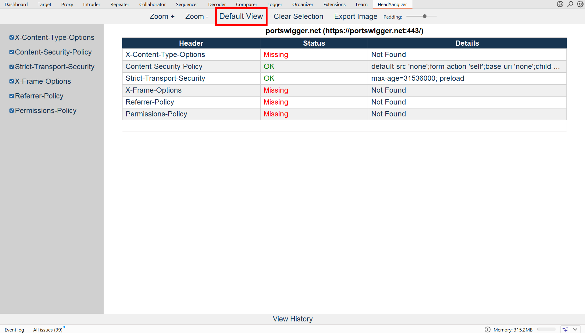  
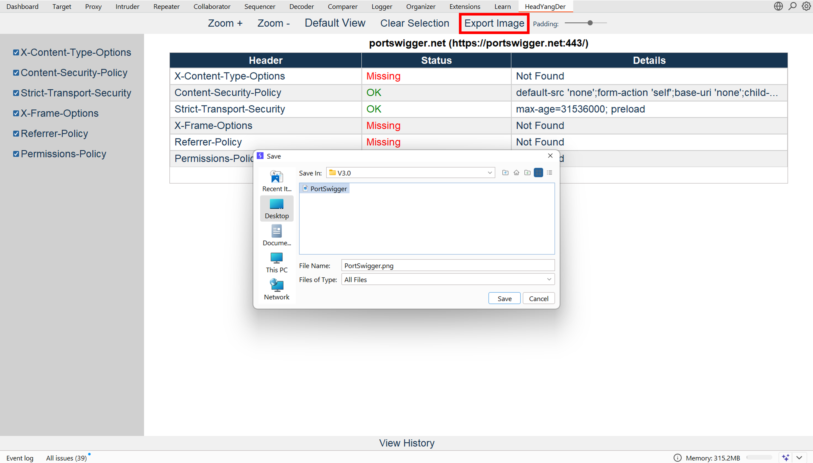  
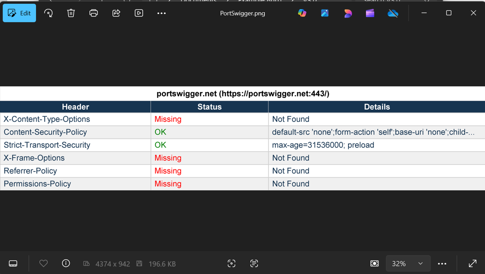  
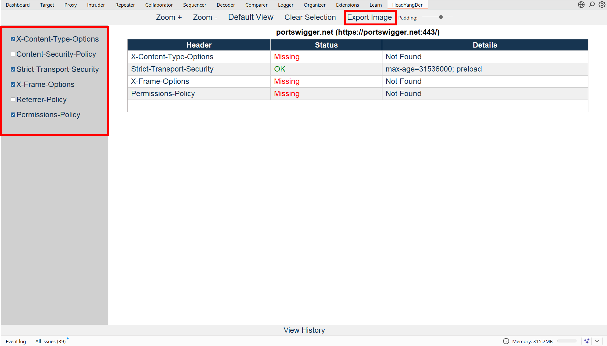  
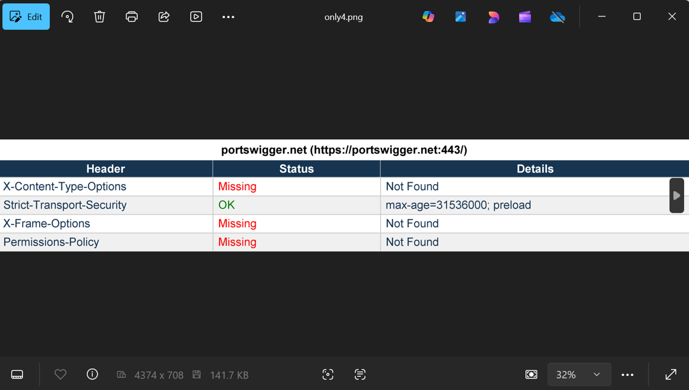  

---

## ✅ Summary

- Easy installation inside Burp Suite  
- Automatic detection of missing/weak headers  
- Exportable results for reporting  
- Lightweight & user-friendly interface  

---

