# HeadYangDer - User Guide

This guide will help you install and use the **HeadYangDer** extension in Burp Suite, with examples and screenshots.

---

## 📥 Installation

1. Open **Burp Suite**.  
2. Go to **Extender → Extensions → Add**.  
3. Select the extension type:  
   - **Python** (using Jython 2.7)  
4. Load `HeadYangDer.py`  
5. The **HeadYangDer** tab will appear in Burp.  

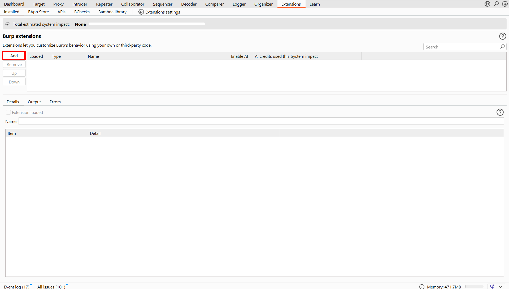

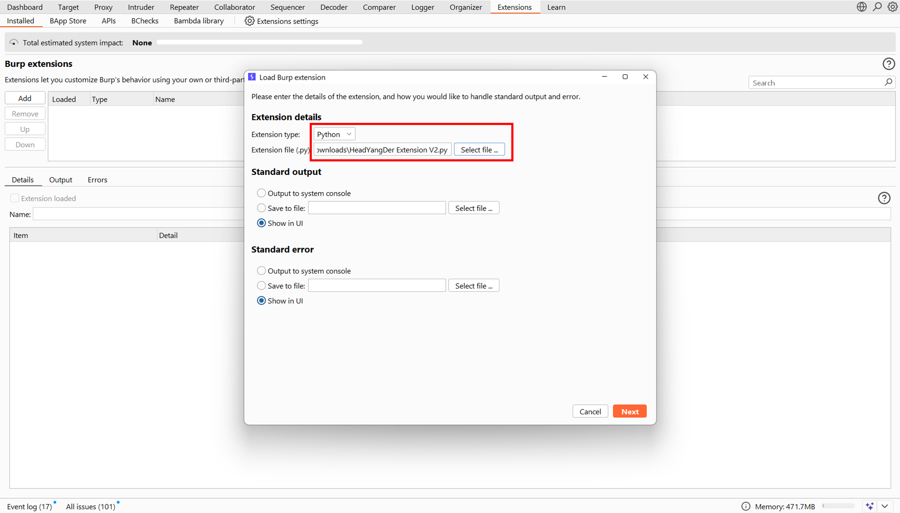

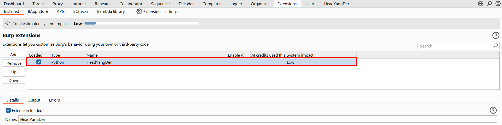

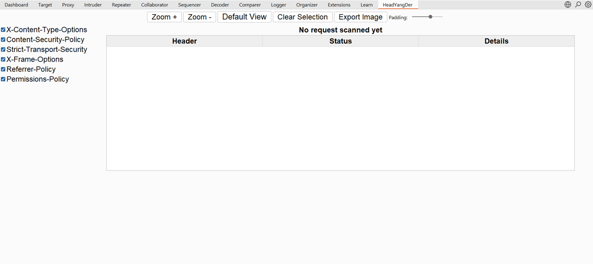

---

## ⚡ Usage

### Step 1: Send a Request to HeadYangDer
From the **Proxy tab** or the **Request/Response view**, right-click and choose:  
`Extensions → HeadYangDer → Send to Header Checker`  

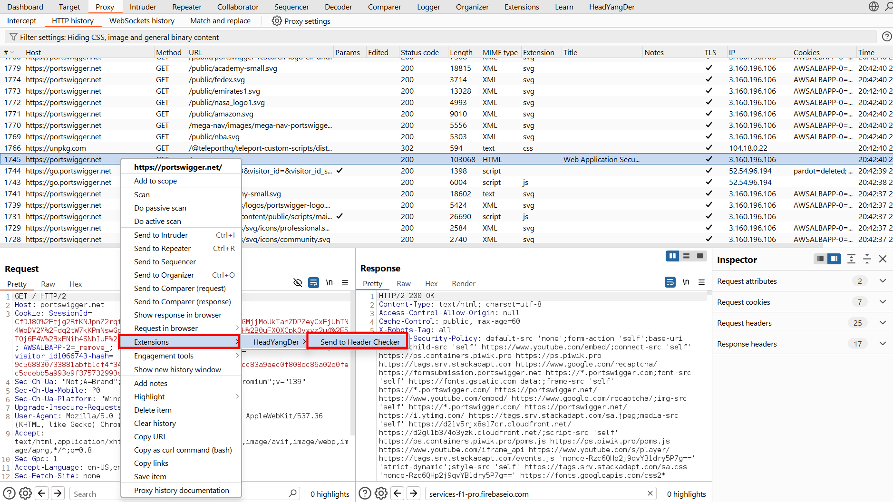  

---

### Step 2: Analyze Headers
Inside the **HeadYangDer** tab you will see the header analysis table.  
By default, all **6 security headers** are selected.  

  

You can also choose only some headers (e.g., 3 out of 6):  

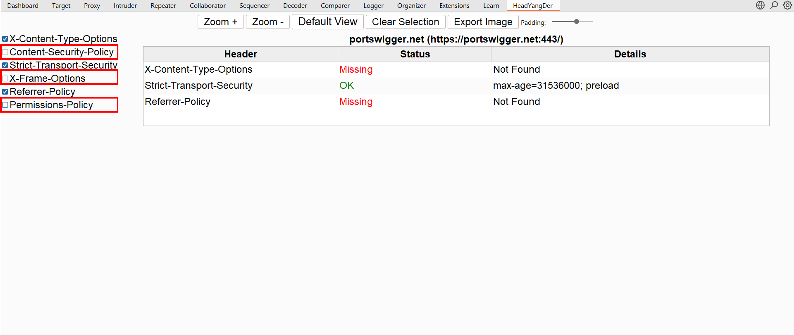  

---

### Step 3: Edit and Interact with Results
- **Edit a cell**: Double-click to modify the value.  
    

- **Highlight a row**: Click once to highlight a request. (for old Version)
    

- **Clear Selection**: Use the **Clear Selection** button to remove highlighting. (for old Version)  
  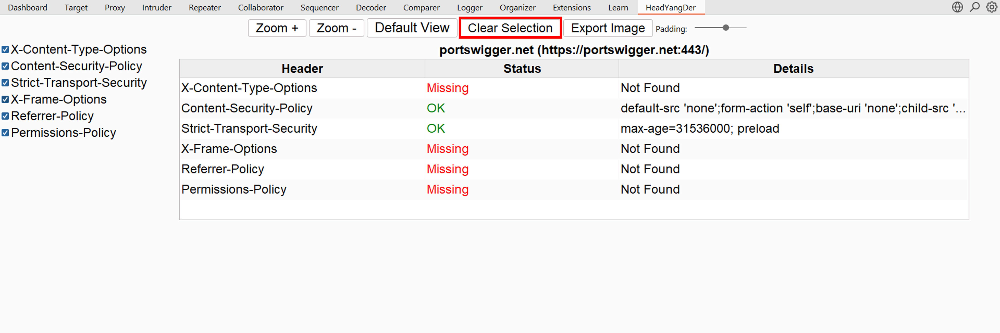  

---

### Step 4: Adjust the View
- **Zoom In**  
  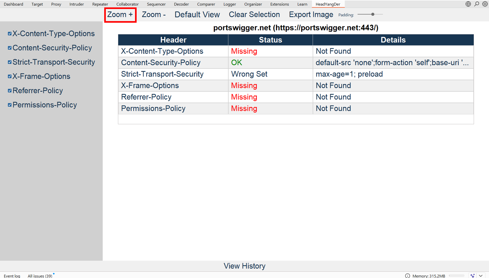  

- **Zoom Out**  
  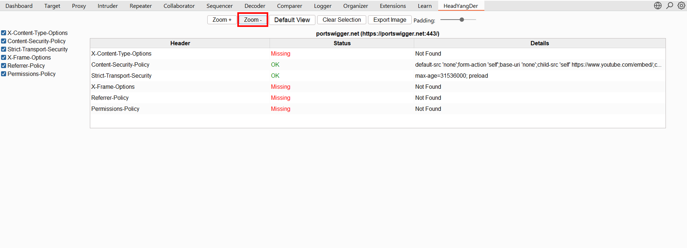  

- **Reset Layout**: Use the **Set Default View** button.  
  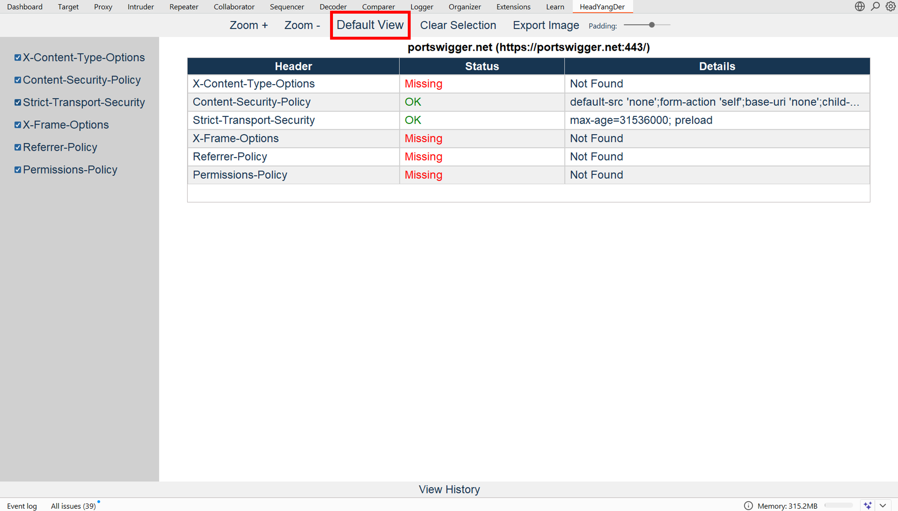  

---

### Step 5: Export Results
You can export the table to **PNG** for reporting.  

- Export with **all 6 headers selected**:  
  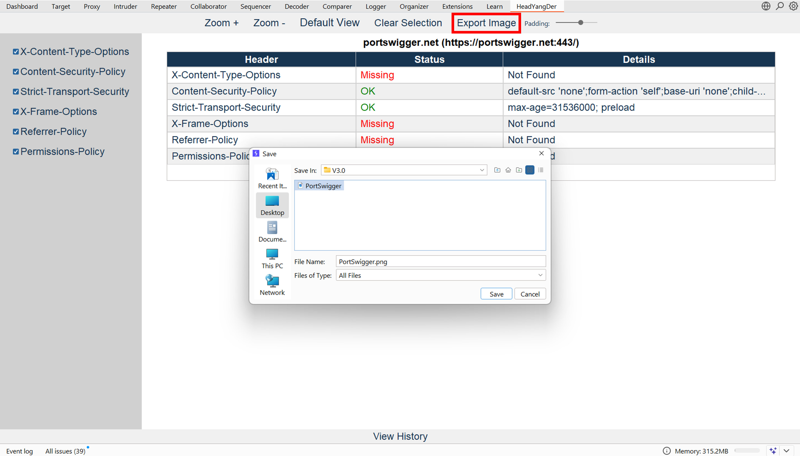  
  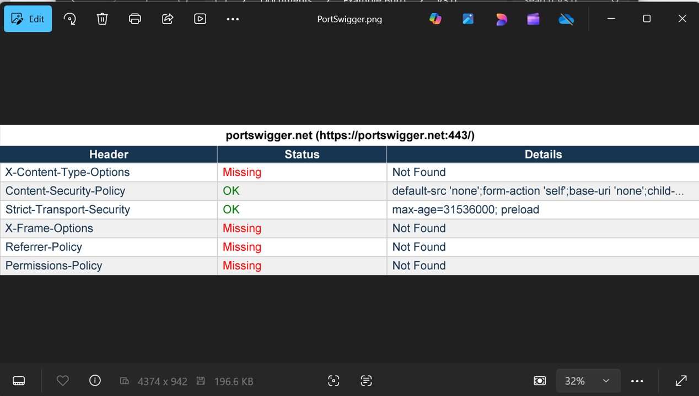  

- Export with **only 4 headers selected**:  
  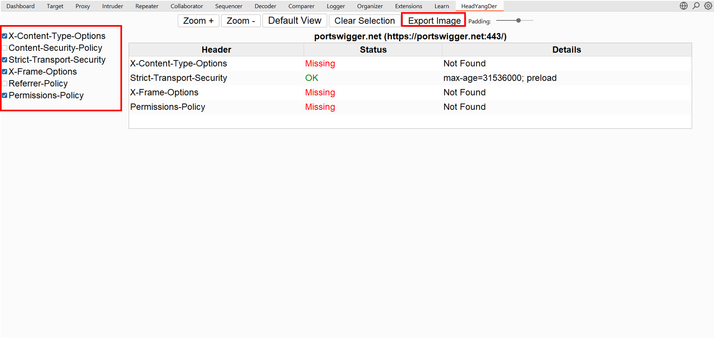  
  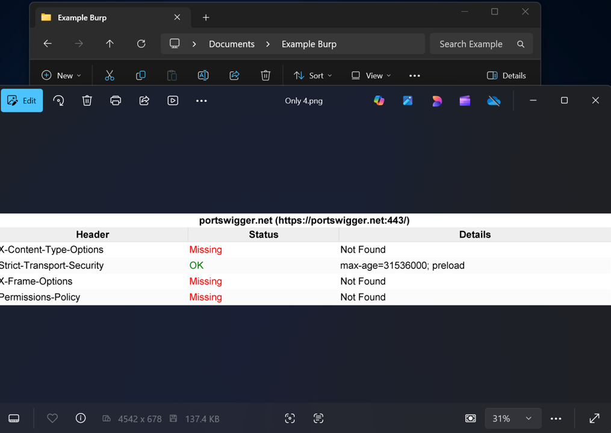  

---

### Step 6: History of Results
You can views past scan and result that can be load and export later.  

- View and Load Past results:  
  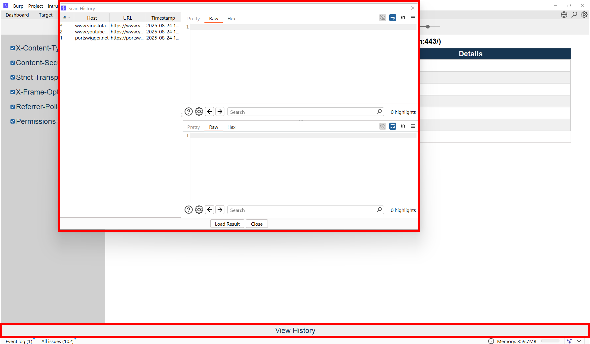  
  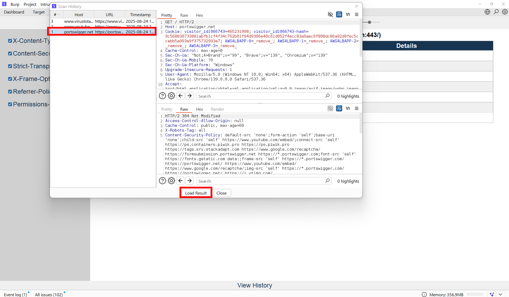  

- You can Delete unwanted history result:  
  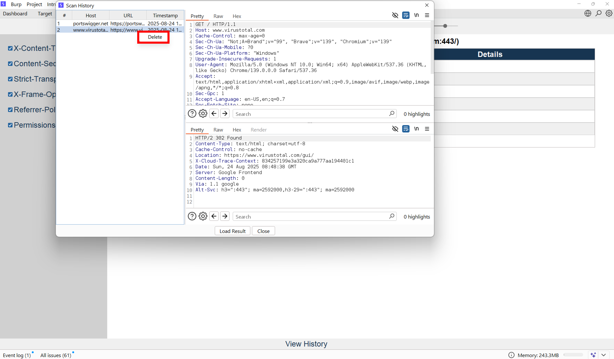  

---

## ✅ That's it, Simple and Looks Clean 

HeadYangDer steps up and makes it simple to check missing or weak HTTP security headers during penetration testing.

