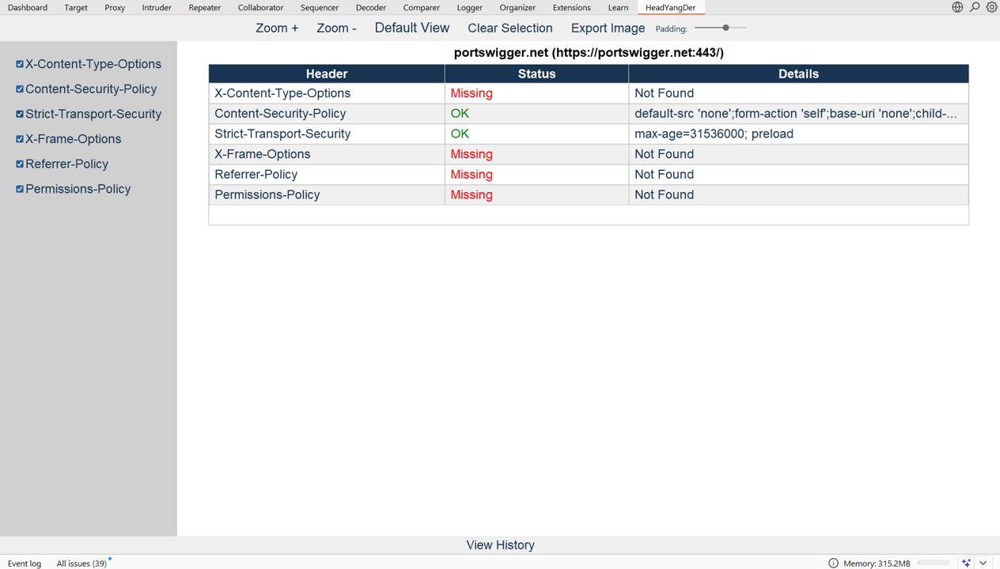

# HeadYangDer

HeadYangDer is a Burp Suite extension designed to make HTTP Headers analysis easier and more efficient during web application penetration testing.  
It provides a clear UI inside Burp Suite, highlights missing or weak security headers, and allows customs exporting results for reporting.

  

## ✨ Features
- Detects missing and misconfigured security headers:
  - X-Frame-Options
  - X-Content-Type-Options
  - Strict-Transport-Security
  - Content-Security-Policy
  - Referrer-Policy
  - Permissions-Policy
- Simple, modern UI integrated into Burp's "HeadYangDer" tab
- Export results for documentation or reporting
- Lightweight and easy to use

## 🚀 📦 Requirements and Installation
- Burp Suite (Community or Professional)
- jython-standalone-2.7+.jar (For Python version)

0. Load the jython to Python Environment in Burp's Extension -> Default Setting

1. Clone this repository:
   ```bash
   git clone https://github.com/Theethat-Thamwasin/HeadYangDer.git
   
2. Open Burp Suite and go to Extender → Extensions → Add.

3. Choose the extension type (Jython).

4. Select the HeadYangDer.py file.

5. The extension tab "HeadYangDer" should now appear.

---

## 📖 Documentation
See the full [User Guide](./Docs/Guide&Examples.md) with step-by-step instructions and screenshots.
[](./Docs/Guide&Examples.md) 
